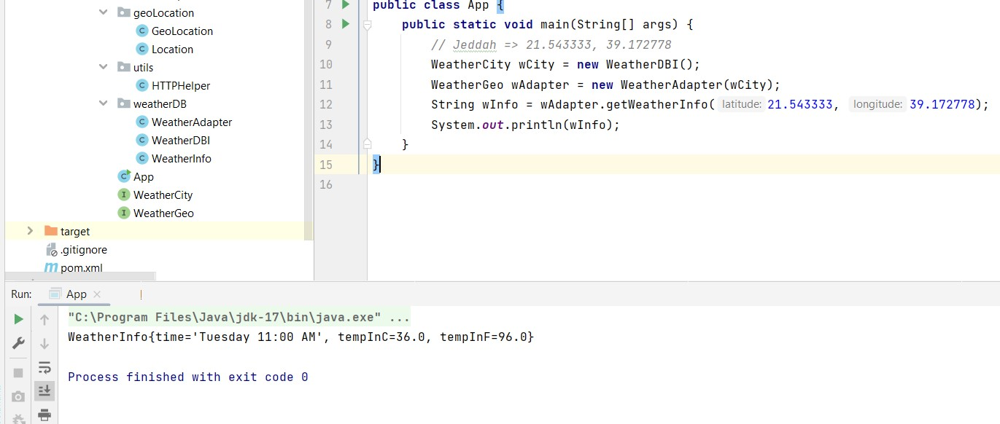

# CPIT252-lab5-submission
This repository contains the deliverables for lab 5 activities for CPIT252

Question 2 in the lab file: Explain how the adapter design pattern binds the client to an interface not a concrete implementation?

Answer: because when implemented in such way, it makes the code less tight coupled, and we can easily change the API if we want to without much change in other places. the interface makes it much more flexible and accepting for change and improvement.

Output:

